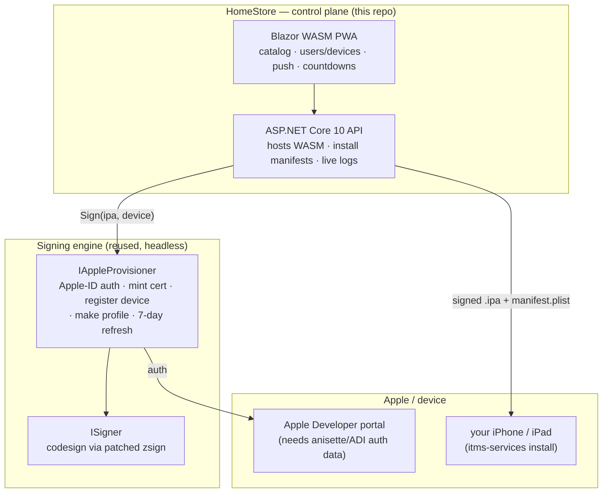

# HomeStore

> A self-hosted, private iOS app store. You register apps, manage your own
> users and devices, and push signed builds to them from one web console.
> The signing is real (valid on current iOS); the UI is the pretty face.

[](https://www.gnu.org/licenses/agpl-3.0)
[](https://dotnet.microsoft.com/)
[](https://learn.microsoft.com/aspnet/core/blazor/)

---

## What this is

HomeStore is a **control plane** for sideloading iOS apps onto **your own**
devices, using **your own** free Apple ID developer provisioning — without a Mac
in the loop and without each user driving the process by hand.

You (the developer/operator) get a web console to:

- **Register apps** — drop in an `.ipa`, give it an icon and a name.
- **Manage users & devices** — a roster of the iPhones/iPads you provision for.
- **Push / install** — hand each device a one-tap install link.
- **Watch expiry** — free-provisioning certs and profiles live ~7 days; HomeStore
  shows live countdowns and re-signs before they lapse.

The hard part — producing a signature that **current iOS actually accepts at
launch** — is already solved (see [Engine](#the-engine-what-actually-signs)).
HomeStore wraps that engine in an API + installable web UI.

> [!IMPORTANT]
> HomeStore is for sideloading apps **you are entitled to install** onto
> **devices you own or administer**, using **your own** Apple ID. It does not
> bypass Apple's security model — it automates the same free-provisioning flow
> Xcode uses, then re-signs and serves the result. It is not a piracy tool and
> ships no copyrighted apps.

---

## How we're different (the part everyone confuses)

There are **four** different things called "Alt-something," plus a couple of
cousins. Conflating them is the #1 source of confusion, so here is the precise
map.

| Project | What it actually is | Where it runs | Maintained? | Relationship to HomeStore |
|---|---|---|---|---|
| **AltStore** | An **iOS app** users install; a personal store on the phone | iOS | ✅ Active (Riley Testut) | **We replace its UX.** We don't ship it. |
| **AltServer** (desktop) | A **Mac/Windows app** that signs & pushes over USB | macOS / Windows | ✅ Active | Not used — desktop only, needs a Mac/PC running |
| **AltServer-Linux** (NyaMisty fork) | A **headless Linux daemon** that does Apple-portal automation + signing | Linux | ⚠️ **Dead repo** (`v0.0.5`, Apr 2022) | **This is our engine.** We build on top of it. |
| **SideStore** | An **iOS app** that signs **on the phone** via a local VPN trick | iOS | ✅ Very active | **Architecturally incompatible** (see below) — but its *libraries* are our escape hatch |
| **Sideloadly** | A desktop sideloading GUI | macOS / Windows | ✅ Active | Not used — desktop only |
| **zsign** | A cross-platform `codesign` replacement | Linux / macOS | ✅ Active | **Our actual code-signing step** |

### The one-sentence positioning

> **HomeStore replaces AltStore's *user experience* (a store you browse and
> install from) with a central, push-based, multi-device web console — while
> reusing AltServer-Linux's *plumbing* (Apple-portal automation) and zsign's
> *signing* underneath.**

We are **not** "a different AltServer." We are a product layer *on top of* the
signing engine, exposing a developer view (register apps, see expiry) and a
fleet view (users/devices) that neither AltStore-the-app nor AltServer ever
gives you.

### Why not "just switch to SideStore"?

SideStore is excellent and actively maintained — but it is an **iOS app that runs
on the phone** and pulls apps for **one device, driven by its owner**. That is
the exact **opposite** of HomeStore's model, which is **server-side, central,
multi-device, push-from-one-console**. Adopting SideStore-the-app would mean
deleting the product and telling every user "install this app and do it
yourself." Same relationship as AltStore: it's a competitor to the *UX*, not an
upgrade path for the *engine*.

What **is** worth adopting from the SideStore org — eventually, only if forced —
are its **Linux-capable libraries** (`apple-private-apis`, `omnisette`), as the
migration target for the one orphaned piece of our stack. See
[Longevity & the escape hatch](#longevity--the-escape-hatch).

---

## The engine: what actually signs



**Today, both `IAppleProvisioner` and `ISigner` are satisfied by
AltServer-Linux** (with its signing step swapped from a stale `ldid` to a patched
**zsign**, so signatures pass AMFI on iOS 17+/26). The control plane never names
AltServer directly — it only talks to the two interfaces.

### Why the signing swap mattered

AltServer-Linux historically signed via a ~4-year-old vendored `ldid` that emits
SHA-1 + legacy-DER signatures. Modern iOS (17+, verified on **iOS 26.5**) rejects
those at launch (`Code=85`) — the app installs but dies on first run. Replacing
the final codesign with a **patched zsign** (SHA-256-only) produces signatures
that launch cleanly. This is already done and verified end-to-end on a physical
**iPhone 16 Pro Max / iOS 26.5**.

> **When upstream zsign merges the fix**, we drop our local patch and pin stock
> zsign — a one-line change with zero architectural impact.

---

## How install actually works on iOS

A web page **cannot** push an app onto iOS directly. The real mechanism is
Apple's enterprise/ad-hoc install manifest:

1. In HomeStore you tap **Install** → Safari is handed an
   `itms-services://?action=download-manifest&url=https://<host>/.../manifest.plist`.
2. iOS fetches a **`manifest.plist`** (over HTTPS with a valid cert) that points
   at the signed **`.ipa`**.
3. The IPA must be signed for **that device's** provisioning profile — which the
   provisioner already mints.

So HomeStore is, mechanically, a **signed-IPA + manifest host with a good UI**.
The "store" is real; the install is `itms-services`. (On the LAN, `devicectl`
direct-install is also supported for tethered devices.)

---

## Architecture

```text
homestore/
├── signer/                    # the headless engine (AltServer-Linux + zsign, Docker)
│                              #   built/published to GHCR; implements the provisioner+signer
├── src/
│   ├── HomeStore.Api/         # ASP.NET Core 10 Web API; also serves the WASM static files
│   ├── HomeStore.Client/      # Blazor WebAssembly PWA (manifest + service worker)
│   └── HomeStore.Shared/      # DTOs/contracts shared by API + Client
└── (later) HomeStore.App/     # MAUI Blazor Hybrid — reuses Client components natively
```

### Decisions

| Concern | Choice | Why |
|---|---|---|
| Backend runtime | **.NET 10 (LTS)** | Long-term support into 2028; verified toolchain present |
| UI | **Blazor WebAssembly PWA** | True installable/offline "Add to Home Screen" on iPhone **and** desktop; clean client/API split. (Blazor *Server* can't be a real offline PWA — it needs a live socket.) |
| Native reuse | **MAUI-ready** | Same Blazor components later host in a MAUI Blazor Hybrid macOS/Windows/iOS/Android app with no UI rewrite |
| Hosting shape | **Single container** | The API serves the WASM bundle *and* the API → one URL, one TLS cert, installable as a PWA |
| Engine boundary | **`IAppleProvisioner` + `ISigner`** | The whole product stays engine-agnostic (see below) |
| License | **AGPL-3.0** | Matches the AltServer-Linux lineage we build on |

---

## Longevity & the escape hatch

The signing problem is solved. The **durable risk is not signing — it's Apple
Developer *auth automation***. AltServer-Linux logs into Apple's portal using
**anisette/ADI** (Apple's one-time-password machinery). Apple rotates that
protocol periodically, and the dead NyaMisty repo won't follow. If that happens,
*signing still works* but *minting a valid profile* breaks.

That is exactly why the engine sits behind a **wide interface**, and why the
migration target is **components, not SideStore-the-app**:

| Function | Today | Replacement if Apple breaks AltServer-Linux | Status of replacement |
|---|---|---|---|
| Apple-ID auth / anisette | AltServer-Linux | [`Dadoum/anisette-v3-server`](https://github.com/Dadoum/anisette-v3-server) (Docker, Linux) | ✅ alive |
| Portal automation (cert/device/profile) | AltServer-Linux | [`SideStore/apple-private-apis`](https://github.com/SideStore/apple-private-apis) Rust crates (`apple-dev-apis`, `icloud-auth`, `omnisette`) | ⚠️ stale (~2 yr, "early stage") — would need revival |
| Codesign | patched **zsign** | patched **zsign** (unchanged) | ✅ alive |

**Migration policy:** stay on AltServer-Linux now (it works); **execute the swap
only when the trigger fires** — i.e. AltServer-Linux's Apple auth actually
breaks. "Abandoned but functional, behind an interface" beats "actively
maintained but the wrong shape." The replacement is an **engine-only daemon
swap** the control plane never notices.

---

## Status

🧪 **Design / pre-implementation.** This README captures the product thesis,
the engine lineage, and the architecture. Code scaffolding has not started.

### Roadmap (high level)

- [ ] `signer/` — package the verified AltServer-Linux + zsign engine behind a
      small local API implementing `IAppleProvisioner` + `ISigner`.
- [ ] `HomeStore.Api` — catalog, devices/users, IPA upload, expiry parsing,
      `itms-services` manifest generation, live sign logs (SSE/SignalR).
- [ ] `HomeStore.Client` — Blazor WASM PWA: app grid, device roster, countdowns,
      one-tap install.
- [ ] Auth model (LAN-only / SSO / PIN) and storage layout.
- [ ] `HomeStore.App` — MAUI Blazor Hybrid wrapper (deferred).
- [ ] Provisioner v2 (anisette-v3-server + revived Rust crates) — **deferred,
      trigger-gated.**

---

## License

[AGPL-3.0](LICENSE). Builds on the AltServer-Linux / AltSign lineage and the
zsign project; see those upstreams for their respective licenses.
