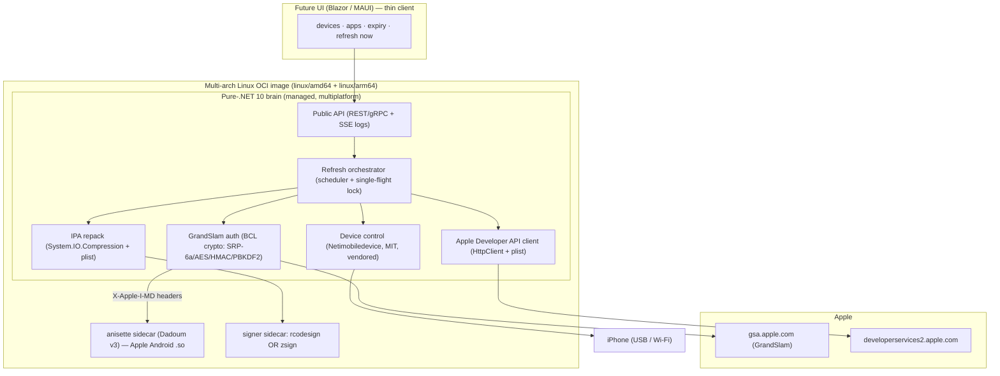

# Sideport — .NET 10 sideload backend: consolidation design (adversarial)

Date: 2026-06-07
Status: design / feasibility (no code yet)
Primary goal: **a multiplatform, self-hosted backend that signs and refreshes
sideloaded iOS apps, exposing a stable API a UI can be built on.**

This document is deliberately adversarial. It takes the prior "single .NET
container" research and tries to break it, then states the calls that survive
the challenge. Every load-bearing claim was validated against the live forks,
the running `home.hont.ro` host, and the upstream projects — not from training
priors.

---

## 1. Executive summary

The current sideload stack is six native dependency families fused by a
Makefile (AltServer-Linux + AltSign + corecrypto→libgsa + zsign + libimobile‑
device family + netmuxd). It is single-arch, hard to extend, and impossible to
put a clean UI on top of.

A .NET 10 rewrite is feasible and worth doing, but the naïve framing — "one
managed binary that runs everywhere" — is **false**. Two pieces have per‑OS
native realities that no managed runtime erases:

1. **Anisette / ADI** depends on Apple's *closed, per‑architecture Android*
   libraries. It can never be pure .NET.
2. **Device USB/Wi‑Fi transport** is OS-specific (usbmux socket, mDNS, pairing).

The honest multiplatform answer is therefore **not** "one .exe everywhere" but
**one multi‑arch Linux OCI image** (`linux/amd64` + `linux/arm64`) containing a
pure‑.NET brain plus exactly **two** non‑managed sidecars (anisette + a signer
binary). "Multiplatform" then means *runs on any host with a container runtime*
— which is what a homelab actually wants.

The adversarial pass produced **two reversals** against the first analysis:

- **Do not P/Invoke libgsa at runtime.** A native crypto lib forces a 5‑RID
  build matrix and re‑introduces the platform coupling we are trying to delete.
  Re‑implement the GrandSlam crypto in the pure managed BCL instead; demote
  libgsa to a clean‑room **spec/oracle**.
- **Do not port AltSign/AltServer source line‑by‑line.** They are **AGPL‑3.0**;
  translating them makes the entire backend + any network UI AGPL. Clean‑room
  reimplement the Apple endpoints (the way `libgsa` was clean‑roomed), keeping
  license freedom.

---

## 2. Goals / Non-goals

### Goals
- One self-hosted service that **authenticates an Apple ID (GrandSlam), manages
  developer resources (certs/app‑IDs/profiles/devices), signs an IPA, installs
  it, and re‑signs on a schedule** before the 7‑day free cert expires.
- A **stable HTTP/gRPC API** (device list, app list + expiry, trigger refresh,
  logs/events) so a UI is a thin client, never coupled to the plumbing.
- **Multiplatform by deployment**: a multi‑arch Linux image runnable on the
  homelab box, a Pi, or any container host; buildable/testable on macOS + Win.
- **License‑clean core** so the backend and a future UI are not forced AGPL.

### Non-goals
- Replacing **anisette** with managed code (impossible — see §5).
- A pure‑managed **Mach‑O code signer** in v1 (largest, least‑proven effort).
- Native desktop single‑binary distribution (`.exe`/`.app`) as the *primary*
  target — possible later, but it re‑opens the per‑OS device/anisette problem.
- iOS 17+ developer‑tunnel (RemoteXPC) features beyond what app install needs.

---

## 3. Current state (validated)

| Layer | Today (native) | Source of truth (verified) |
|---|---|---|
| Apple ID login (GrandSlam) | AltSign `AppleAPI+Authentication.cpp` + **libgsa** (our OpenSSL SRP/AES/HMAC/PBKDF2) | `dragoshont/AltSign-Linux@9a0d70a` |
| Device attestation (anisette) | `dadoum/anisette-v3-server` container, `:6969` | live on host (Up, `/v3/client_info` 200) |
| Apple Developer API | AltSign `Certificate/AppID/Team/Device/ProvisioningProfile.cpp` + `cpprestsdk`/`boost` | `dragoshont/AltSign-Linux` |
| Code signing | **zsign** sidecar (PR #391 — fixes Code=85) | `dragoshont/zsign@fe1750d` |
| IPA packaging | `minizip`/`libzip` + `Archiver.cpp` | AltSign + AltServer |
| Device transport | libplist + libusbmuxd + libimobiledevice + ideviceinstaller + glue, **+ netmuxd** (Rust Wi‑Fi muxer) | `.gitmodules` + host tools 1.3.0 |

Native link line (live `Makefile` L98/120, corecrypto already swapped to gsa):

```
-static -lssl -lcrypto -lpthread -lgsa -lzip -lz -lcpprest \
        -lboost_system -lboost_filesystem -lstdc++ -luuid
```

The genuinely hard surface — AltSign's protocol layer — is only **~15 files**
(`Account, AnisetteData, AppGroup, AppID, AppleAPI(+Authentication,+Session),
Application, Archiver, Certificate, CertificateRequest, Device,
ProvisioningProfile, Signer, Team`). That, plus auth, is the real port budget.

---

## 4. Target architecture



Three stable seams keep the UI and the plumbing decoupled:
`IAnisetteProvider`, `ISigner`, `IDeviceController`. The Apple auth + dev‑API
live behind `IAppleDeveloperPortal` — the only code we truly own and write.

---

## 5. Anisette / v3-server — the load-bearing constraint (special attention)

This is the piece most likely to be hand‑waved, so it gets its own section.

### 5.1 What it actually is (validated against Dadoum/Provision)
`anisette-v3-server` is a **thin D wrapper (92% D)** over `Dadoum/Provision`'s
`libprovision`. `libprovision` `dlopen`s **Apple's proprietary Android
libraries** `libstoreservicescore.so` + `libCoreADI.so`, extracted from the
**Apple Music APK**, and drives Apple's CoreADI one‑time‑password generator to
mint the `X-Apple-I-MD*` anisette headers GrandSlam requires. It registers a
synthetic machine that **impersonates a Mac** (`<MacBookPro13,2> <macOS;13.1>
<com.apple.AuthKit/1>`) and stores the resulting **ADI + device identity** in a
config volume (`~/.config/anisette-v3/lib/` + Provision config / `adi.pb`).

Apple's own words via the project: those libraries are *"not redistributed for
legal reasons."* There is **no managed re‑implementation and there cannot be
one** — CoreADI is closed Apple code.

### 5.2 Adversarial findings that change the design
1. **Architecture‑specific, not "just a Linux .so".** Provision loads
   `ADI("lib/" ~ architectureIdentifier)` — it needs the Android **ABI slice**
   matching the host (`arm64-v8a`, `x86_64`, …). Consequences:
   - Runs on **Linux x86_64 / arm64** hosts (homelab box ✔, Pi ✔).
   - **Cannot** be `dlopen`‑ed natively on **macOS (Mach‑O)** or **Windows
     (PE)**. On those hosts you run anisette **as a Linux container** anyway.
   - ⇒ This single fact is why the product ships as a **Linux image**, not a
     native desktop binary. It is the root cause of the multiplatform shape.
2. **Persistence is not optional.** The ADI/device volume *is* a trusted‑device
   registration with Apple. Lose it / re‑provision and Apple burns a
   trusted‑device slot and forces re‑2FA. The volume must be a **named, backed‑
   up volume**, pinned to one identity. Treat it like a secret.
3. **External single point of failure.** It is single‑maintainer D code that
   wraps libraries Apple can rotate at will (the embedded Apple Music client
   fingerprint can be invalidated). We cannot fix a break in‑process.
4. **Supply‑chain + privacy.** The image is `dadoum/anisette-v3-server` on
   Docker Hub (no GHCR release; "No packages published"). **Pin by digest** and
   **self‑host** — a public/shared anisette sees identifiers tied to your auth.

### 5.3 Design response
Make anisette a **provider behind `IAnisetteProvider`**, spoken to over the
stable v3 HTTP contract (`/v3/client_info`, `/v3/get_headers`):

| Provider | Use | Verdict |
|---|---|---|
| `ContainerV3` (Dadoum v3, pinned digest, persisted volume) | default | **adopt** |
| `RemoteV3` (point at an external anisette URL) | break‑glass / desktop dev | keep as fallback |
| `NativeMac`/`NativeWin` (Apple AOSKit/AuthKit on the host) | macOS/Win native | **reject** (private API, OS‑locked, defeats the goal) |

The HTTP boundary is also a **license firewall**: Provision is LGPL/AGPL‑adjacent
D code; calling it as an unmodified separate process over HTTP keeps it out of
our derivative‑work graph.

---

## 6. Import vs port vs rewrite — the adversarial matrix

Three axes decide each component: **effort**, **license**, **multiplatform**.

| Component | Decision | Why it survives the adversarial pass |
|---|---|---|
| Device protocol (usbmux, lockdown, pairing, `installation_proxy`, `misagent`) | **IMPORT** `artehe/Netimobiledevice` (MIT), **vendored at a pinned SHA** | Pure managed, cross‑platform, MIT. NuGet listing is flagged unmaintained / `v2.5.2` unlisted → **do not float the NuGet feed**; vendor a known‑good commit. |
| Wi‑Fi device **discovery** (mDNS `_apple-mobdev2._tcp`) | **REWRITE** in .NET (`Makaretu.Dns`/Zeroconf) **or** keep **netmuxd** as a tiny sidecar | **Resolved (spike done):** keep **netmuxd** as the discovery sidecar — Netimobiledevice does **not** do its own Bonjour discovery. netmuxd advertises Wi‑Fi devices over the usbmux socket but does **not proxy** the usbmux `Connect`, so Sideport reaches Wi‑Fi devices by **direct TCP lockdown** (`MobileDevice.CreateUsingTcp` to the device's `NetworkAddress`:62078), validating trust against the host pairing record (`/var/lib/lockdown`, mounted read‑only). USB stays usbmux‑proxied. |
| GrandSlam **crypto** (SRP‑6a, AES‑GCM/CBC, HMAC, PBKDF2, const‑time eq) | **REWRITE** pure C# (`System.Numerics.BigInteger` + `System.Security.Cryptography` + `CryptographicOperations.FixedTimeEquals`) | **Reversal:** P/Invoking libgsa forces native artifacts per RID and re‑couples to platform. We already know the exact byte recipe (libgsa + pypush oracle), so a ~few‑hundred‑line managed port is cheap and stays multiplatform. libgsa → **oracle in tests**, not a runtime dep. |
| GrandSlam **auth protocol** (SPD/ADSID/session, s2k) | **REWRITE** clean‑room | Small surface; clean‑room from pypush spec avoids AGPL (see below). |
| Apple **Developer API** (teams, devices, CSR→cert, app‑IDs+capabilities, app‑groups, profiles) | **REWRITE** clean‑room from Apple's documented `developerservices2` endpoints | **License:** AltSign is **AGPL‑3.0**; translating it makes our backend+UI AGPL. The endpoints are mechanical plist‑over‑HTTPS — reimplement, don't translate. |
| IPA **signing** | **IMPORT** as a **sidecar binary**: `rcodesign` (`indygreg/apple-platform-rs`, Apache‑2.0) **preferred**, `zsign` (MIT, already proven on host) as the safe default | Pure‑.NET Mach‑O signing (CodeDirectory hashes, entitlements/requirements blobs, CMS) is the biggest, least‑proven effort. Both candidates are cross‑platform binaries and license‑clean. Start with **zsign** (battle‑tested here), migrate to `rcodesign` to drop a C++ artifact. |
| IPA (un)zip + plist | **REWRITE** (trivial: `System.IO.Compression` + `Claunia.PropertyList`) | First‑party; no reason to import. |
| `libimobiledevice` / `ideviceinstaller` / `libusbmuxd` / `libplist` | **DROP** | Wholly replaced by Netimobiledevice. |
| `cpprestsdk` / `boost` / AltSign C++ | **DROP** | Replaced by `HttpClient` + managed code. |
| **corecrypto / libgsa at runtime** | **DROP from runtime** (keep libgsa as test oracle) | See crypto reversal above. |

### License ledger (verified)
- **Safe to import:** Netimobiledevice **MIT**, rcodesign **Apache‑2.0**, zsign **MIT**.
- **Do not translate:** AltSign / AltServer / AltStore lineage **AGPL‑3.0**.
- **Keep at HTTP arm's length:** Dadoum Provision/anisette (LGPL/AGPL‑adjacent).
- **Net effect:** the new core can be permissively licensed; AGPL stays outside
  our process boundary.

---

## 7. The multiplatform truth table

"One binary everywhere" is the wrong mental model. What actually runs where:

| Host | .NET brain | Device USB/Wi‑Fi | Anisette | Net result |
|---|---|---|---|---|
| **Linux x64/arm64** (homelab, Pi) | native | native (usbmux + netmuxd/mDNS) | **native container** | **Primary target — everything works in one image** |
| **macOS** | native | Netimobiledevice "needs work" | Android .so **won't load** → run anisette in Docker | works **only via a Linux container** for anisette |
| **Windows** | native | needs Apple usbmuxd (iTunes) | Apple AOSKit (iTunes/iCloud) **or** Docker | works, but desktop‑native path is its own project |

**Conclusion:** ship a **multi‑arch Linux OCI image** as the unit of
distribution. Multiplatform = "any host with a container runtime." Native
desktop builds are a *later, optional* track, explicitly out of v1 scope.

---

## 8. Effort assessment

Honest sizing. The two **Medium** items are the whole real cost; everything
else is glue because device‑comm and signing are adopted, not written.

| Phase | Work | Size |
|---|---|---|
| 0 — Skeleton | .NET 10 minimal API, DI, config, `IAnisetteProvider` (HTTP), `ISigner` (process), single‑flight refresh lock | S |
| 1 — Device plane | Vendor Netimobiledevice; discover (USB + Wi‑Fi), pair, list installed apps + expiry, install/uninstall; resolve the **mDNS discovery gap** (spike) | S–M |
| 2 — **Auth plane** | GrandSlam: managed SRP‑6a + s2k + anisette headers → ADSID/SPD/session. Validate against the libgsa oracle vectors | **M (keystone)** |
| 3 — **Dev‑API plane** | listTeams · device add/list · CSR→cert · app‑ID + capabilities · app‑group · profile fetch (clean‑room) | **M** |
| 4 — Refresh loop | auth → ensure cert/app‑ID/profile → re‑sign (sidecar) → install; countdowns, retries, structured logs/SSE | M |
| 5 — Hardening | SOPS‑encrypted Apple creds, persisted anisette volume + backup, health endpoints, multi‑arch image build | S |

No novel cryptography or protocol research remains: libgsa proved the crypto
byte‑for‑byte, and AltSign + SideStore's `apple-private-apis` (Rust, MPL‑2.0)
give **two** independent references to clean‑room against.

---

## 9. Risks & open questions

| Risk | Severity | Mitigation |
|---|---|---|
| Anisette breaks when Apple rotates CoreADI / Apple Music client | High | Pin image digest; persist ADI volume; keep `RemoteV3` fallback; monitor a synthetic auth probe |
| Lose the ADI/device volume → burns Apple trusted‑device slot + 2FA | High | Named volume, backed up, treated as a secret; never re‑provision casually |
| Netimobiledevice doesn't do Wi‑Fi mDNS discovery | Medium | Spike first; fall back to a netmuxd sidecar or a managed mDNS lib |
| Netimobiledevice NuGet flagged unmaintained / yanked versions | Medium | Vendor a pinned commit, not the floating NuGet feed |
| Accidental AGPL contamination from reading AltSign too closely | Medium | Clean‑room from Apple endpoint docs + pypush spec; record provenance |
| iOS 17+ transport changes | Low for *install* | App install uses classic lockdown + `installation_proxy`; RemoteXPC tunnel only needed for dev tooling we don't ship |
| Apple Developer free‑tier limits (10 app‑IDs/week, 7‑day certs, 3 apps) | Low | Orchestrator schedules within limits; surface limits in the API |

---

## 10. Recommendation

1. Build the **pure‑.NET brain** (auth + dev‑API + orchestrator + IPA repack)
   as a permissively‑licensed, clean‑room codebase; reuse libgsa **only** as a
   test oracle.
2. **Vendor Netimobiledevice** for device transport; spike the Wi‑Fi discovery
   question before committing to "no netmuxd."
3. Keep **two non‑managed sidecars**: **anisette** (irreducible) and a **signer
   binary** (zsign now → rcodesign later). Both are cross‑platform and license‑
   clean; both sit behind interfaces.
4. Ship as a **multi‑arch Linux OCI image**. Treat native desktop as a future,
   separate track.
5. Hold the three seams (`IAnisetteProvider`, `ISigner`, `IDeviceController`)
   plus `IAppleDeveloperPortal` as hard boundaries so the UI never learns the
   plumbing.

The result is materially **simpler than today** (drops the entire musl/boost/
cpprest/libimobiledevice build chain and netmuxd, collapses five processes to
one image + two sidecars) and is **multiplatform where it counts** — any
container host — while being honest that anisette and device USB access keep one
foot in native, OS‑specific reality.

---

## Appendix A — provenance of claims
- AltServer/AltSign deps & link line: `dragoshont/AltServer-Linux` `.gitmodules`
  + `Makefile` (live).
- Anisette internals: `Dadoum/Provision` + `Dadoum/anisette-v3-server` READMEs
  (Apple Music `.so`, per‑arch `ADI("lib/"~arch)`, Mac impersonation, config
  volume, "not redistributed").
- Signing options: `indygreg/apple-platform-rs` (rcodesign, Apache‑2.0) concepts
  doc; `dragoshont/zsign@fe1750d` (PR #391, Code=85 fix) proven on host.
- Device comm: `artehe/Netimobiledevice` tree (Usbmux/Lockdown/Pairing/
  installation_proxy/misagent/Remoted), MIT, demo on .NET 10.
- Crypto recipe: `dragoshont/libgsa` (SRP‑6a/AES/HMAC/PBKDF2, 19/19 vs MIT‑`srp`
  golden oracle derived from `JJTech0130/pypush`).
- Reference architecture: `SideStore/apple-private-apis` (omnisette / icloud‑auth
  / apple‑dev‑apis / codesign‑wrapper), Rust, MPL‑2.0.
